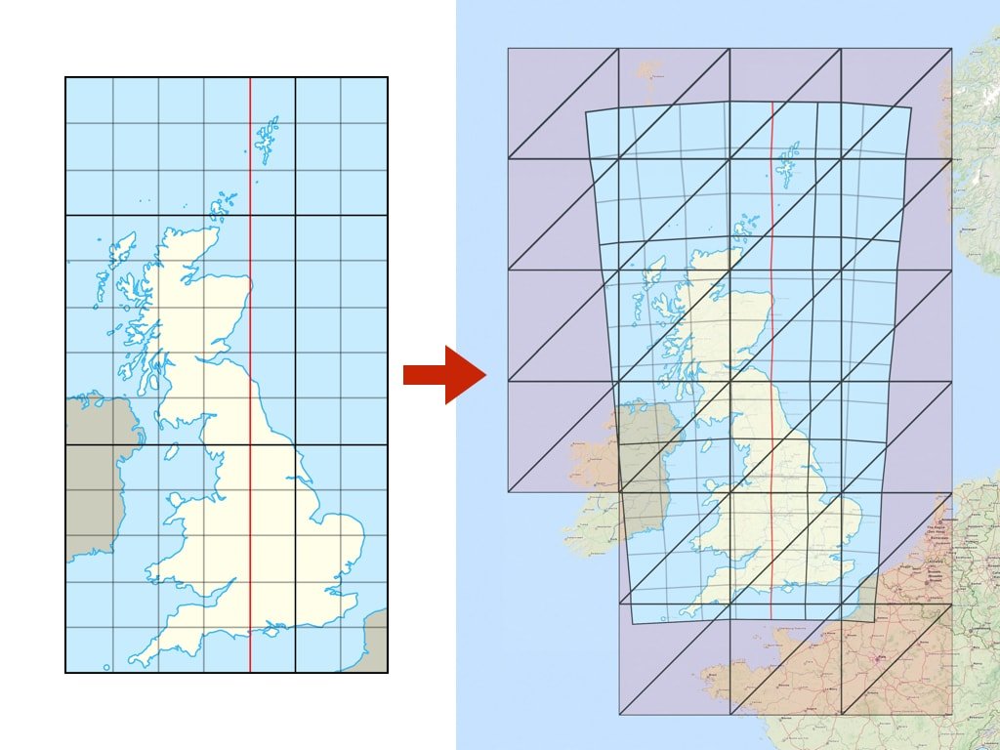
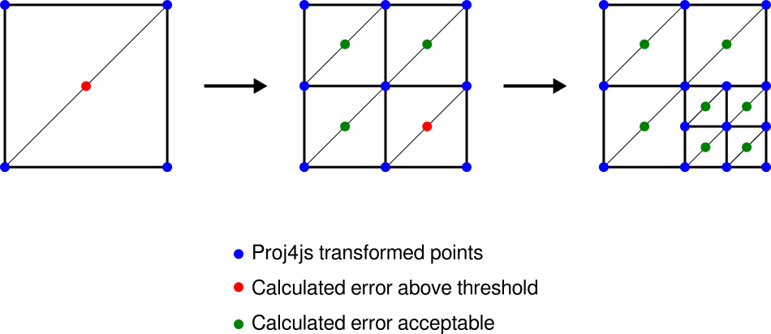
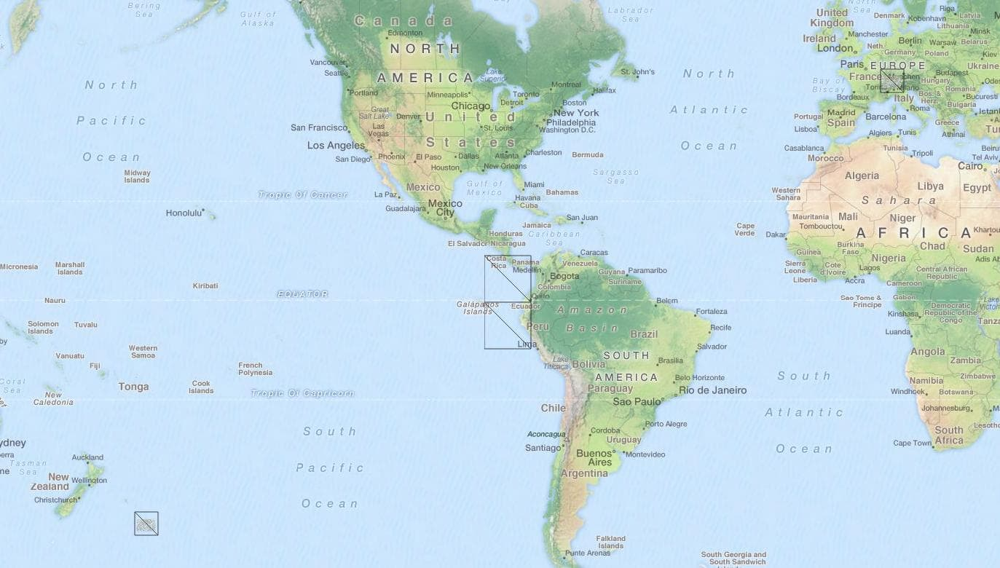

# Raster Reprojection

OpenLayers 3 has an ability to display raster data from WMS, WMTS, static images and many other sources in a different coordinate system than delivered from the server.
Transformation of the map projections of the image happens directly in a web browser.
The view in any Proj4js supported coordinate reference system is possible and previously incompatible layers can now be combined and overlaid.

# Usage
The API usage is very simple. Just specify proper projection (using [EPSG](http://epsg.io) code) on `ol.View`:
``` javascript
var map = new ol.Map({
  target: 'map',
  view: new ol.View({
    projection: 'EPSG:3857', //HERE IS THE VIEW PROJECTION
    center: [0, 0],
    zoom: 2
  }),
  layers: [
    new ol.layer.Tile({
      source: new ol.source.TileWMS({
        projection: 'EPSG:4326', //HERE IS THE DATA SOURCE PROJECTION
        url: 'http://demo.boundlessgeo.com/geoserver/wms',
        params: {
          'LAYERS': 'ne:NE1_HR_LC_SR_W_DR'
        }
      })
    })
  ]
});
```
If a source (based on `ol.source.TileImage` or `ol.source.Image`) has a projection different from the current `ol.View`’s projection then the reprojection happens automatically under the hood.

### Examples
- [Raster reprojection demo](http://openlayers.org/en/master/examples/reprojection.html)
- [OpenStreetMap to WGS84 reprojection](http://openlayers.org/en/master/examples/reprojection-wgs84.html)
- [Reprojection with EPSG.io database search](http://openlayers.org/en/master/examples/reprojection-by-code.html)
- [Image reprojection](http://openlayers.org/en/master/examples/reprojection-image.html)

### Custom projection
The easiest way to use a custom projection is to add the [Proj4js](http://proj4js.org/) library to your project and then define the projection using a proj4 definition string.
Following example shows definition of a [British National Grid](http://epsg.io/27700):

``` html
<script type="text/javascript" src="https://cdnjs.cloudflare.com/ajax/libs/proj4js/2.3.14/proj4.js"></script>
```

``` javascript
proj4.defs('EPSG:27700', '+proj=tmerc +lat_0=49 +lon_0=-2 +k=0.9996012717 ' +
    '+x_0=400000 +y_0=-100000 +ellps=airy ' +
    '+towgs84=446.448,-125.157,542.06,0.15,0.247,0.842,-20.489 ' +
    '+units=m +no_defs');
var proj27700 = ol.proj.get('EPSG:27700');
proj27700.setExtent([0, 0, 700000, 1300000]);
```

### Change of the view projection
To switch the projection used to display the map you have to set a new `ol.View` with selected projection on the `ol.Map`:
``` javascript
map.setView(new ol.View({
    projection: 'EPSG:27700',
    center: [400000, 650000],
    zoom: 4
  }));
```

## TileGrid and Extents
When reprojection is needed, new tiles (in the target projection) are under the hood created from the original source tiles.
The TileGrid of the reprojected tiles is by default internally constructed using `ol.tilegrid.getForProjection(projection)`.
The projection should have extent defined (see above) for this to work properly.

Alternatively, a custom target TileGrid can be constructed manually and set on the source instance using `ol.source.TileImage#setTileGridForProjection(projection, tilegrid)`.
This TileGrid will then be used when reprojecting to the specified projection instead of creating the default one.
In certain cases, this can be used to optimize performance (by tweaking tile sizes) or visual quality (by specifying resolutions).

# How it works

The reprojection process is based on triangles -- the target raster is divided into a limited number of triangles with vertices transformed using `ol.proj` capabilities ([proj4js](http://proj4js.org/) is usually utilized to define custom transformations).
The reprojection of pixels inside the triangle is approximated with an affine transformation (with rendering hardware-accelerated by the canvas 2d context):



This way we can support a wide range of projections from proj4js (or even custom transformation functions) on almost any hardware (with canvas 2d support) with a relatively small number of actual transformation calculations.

The precision of the reprojection is then limited by the number of triangles.

The reprojection process preserves transparency on the raster data supplied from the source (png or gif) and the gaps and no-data pixels generated by reprojection are automatically transparent.

###Dynamic triangulation

The above image above shows a noticeable error (especially on the edges) when the original image (left; EPSG:27700) is transformed with only a limited number of triangles (right; EPSG:3857).
The error can be minimized by increasing the number of triangles used.

Since some transformations require a more detail triangulation network, the dynamic triangulation process automatically measures reprojection error and iteratively subdivides to meet a specific error threshold:



For debugging, rendering of the reprojection edges can be enabled by `ol.source.TileImage#setRenderReprojectionEdges(true)`.

# Advanced

### Disabling reprojection
In case you are creating a custom build of OpenLayers and do not need the reprojection code, you can reduce the build size by setting `ol.ENABLE_RASTER_REPROJECTION` to `false`, which completely disables the reprojection support.
See [Custom builds](custom-builds.html#defines) tutorial on how to do this.

### Triangulation precision threshold
The default [triangulation error threshold](#dynamic-triangulation) in pixels is given by `ol.DEFAULT_RASTER_REPROJECTION_ERROR_THRESHOLD` (0.5 pixel).
In case a different threshold needs to be defined for different sources, the `reprojectionErrorThreshold` option can be passed when constructing the tile image source.

###Limiting visibility of reprojected map by extent

The reprojection algorithm uses inverse transformation (from *view projection* to *data projection*).
For certain coordinate systems this can result in a "double occurrence" of the source data on a map.
For example, when reprojecting a map of Switzerland from EPSG:21781 to EPSG:3857, it is displayed twice: once at the proper place in Europe, but also in the Pacific Ocean near New Zealand, on the opposite side of the globe.



Although this is mathematically correct behavior of the inverse transformation, visibility of the layer on multiple places is not expected by users.
A possible general solution would be to calculate the forward transformation for every vertex as well - but this would significantly decrease performance (especially for computationally expensive transformations).

Therefore a recommended workaround is to define a proper visibility extent on the `ol.layer.Tile` in the view projection.
Setting such a limit is demonstrated in the [reprojection demo example](http://openlayers.org/en/master/examples/reprojection.html).

### Resolution calculation
When determining source tiles to load, the ideal source resolution needs to be calculated.
The `ol.reproj.calculateSourceResolution(sourceProj, targetProj, targetCenter, targetResolution)` function calculates the ideal value in order to achieve pixel mapping as close as possible to 1:1 during reprojection, which is then used to select proper zoom level from the source.

It is, however, generally not practical to use the same source zoom level for the whole target zoom level -- different projections can have significantly different resolutions in different parts of the world (e.g. polar regions in EPSG:3857 vs EPSG:4326) and enforcing a single resolution for the whole zoom level would result in some tiles being scaled up/down, possibly requiring a huge number of source tiles to be loaded.
Therefore, the resolution mapping is calculated separately for each reprojected tile (in the middle of the tile extent).
